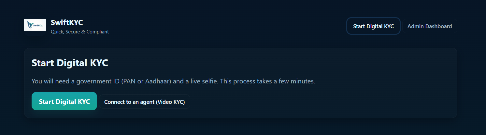
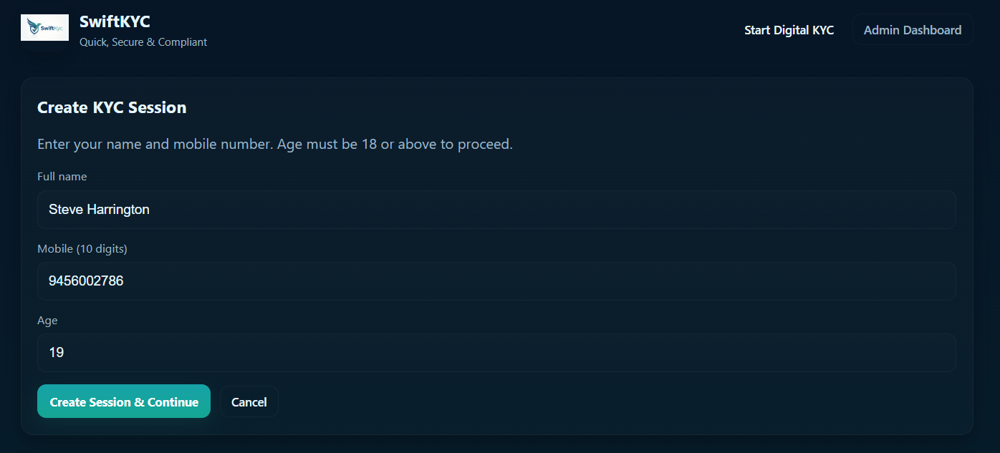
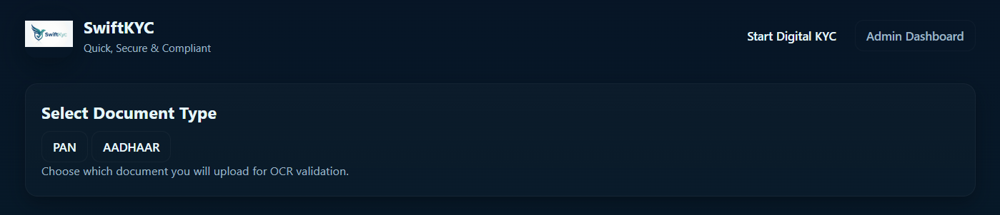
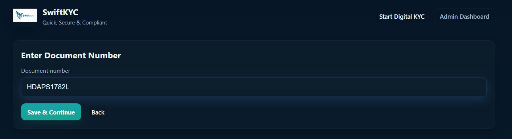
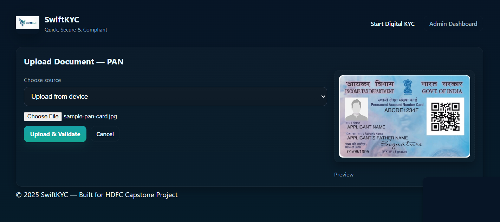
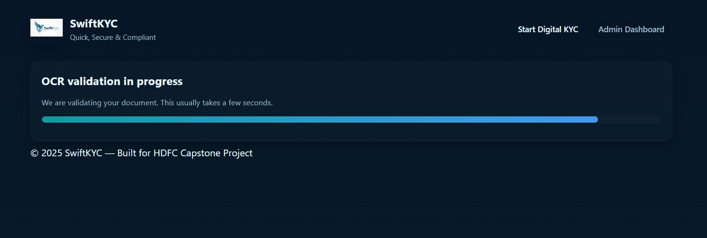
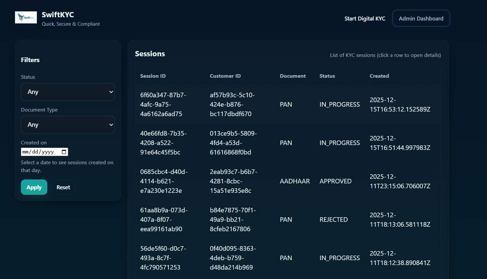
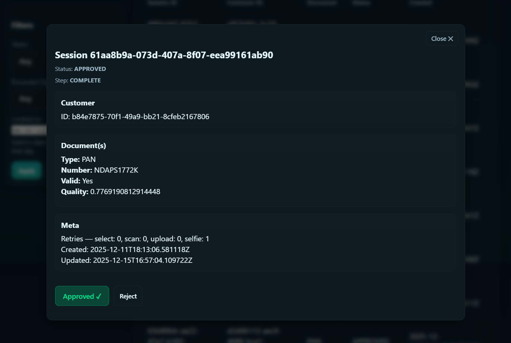
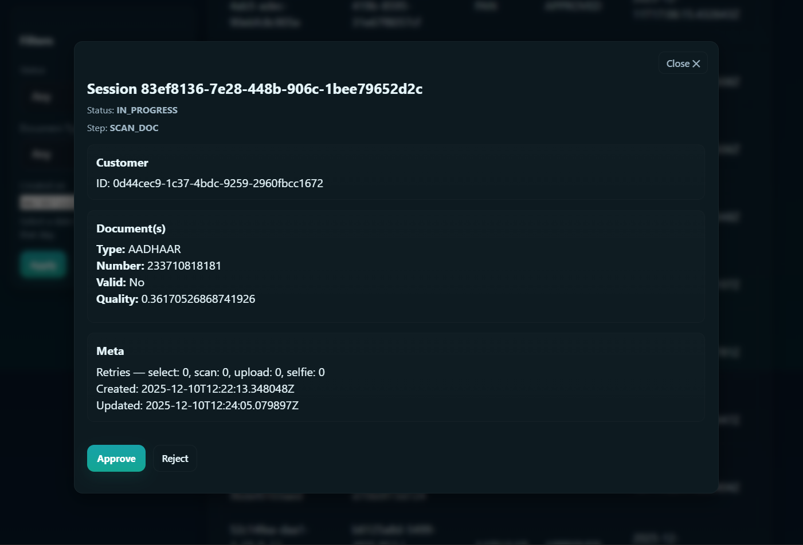
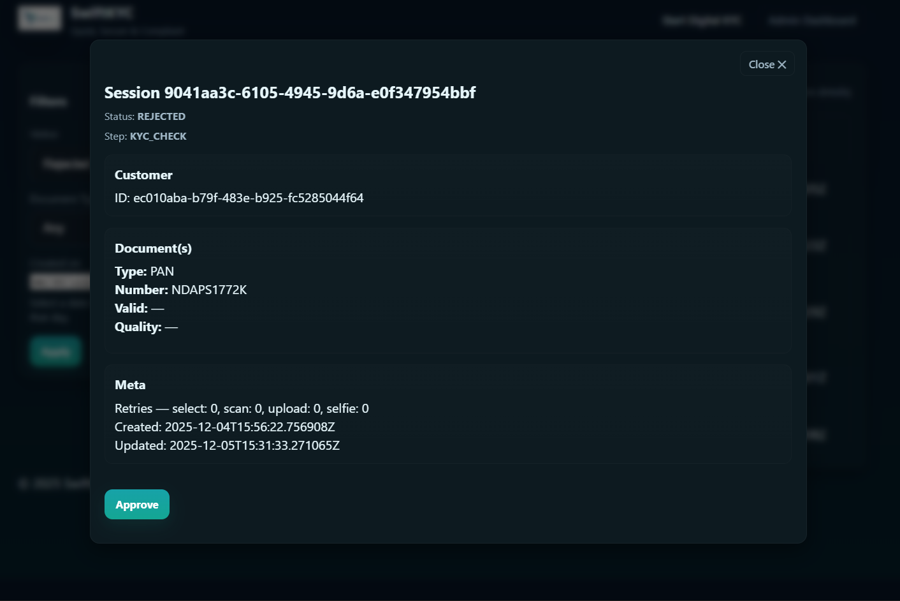

# 🚀 SwiftKYC: Focused Digital Onboarding System

SwiftKYC is a focused digital onboarding system built to streamline **document scanning, OCR validation, selfie verification, and admin review**. It pairs a **FastAPI** backend (OCR via EasyOCR, validation logic, admin APIs) with a simple **HTML/CSS/JS** frontend for rapid iteration and testing.

---

## 🐛 Problem Statement 

Banks face high customer drop-off and high KYC rejection rates caused by:

* **Duplicate KYCs**
* **Slow server response times**
* **Poor image scans / bad selfies**
* **Insufficient user guidance at each step**
* **Automatic rejection after repeated failed attempts**

### Goals:
Fewer abandonments, faster Turnaround Time (TAT), clearer next-step visibility, fewer re-submissions, and better admin tools for exception handling.

---

## ✨ How SwiftKYC Solves the Problem

SwiftKYC addresses the pain points with the following features:

### User Experience & Guidance
* **Clear, Guided Multi-step Wizard:** The frontend enforces a step-by-step flow:
    * Create Session
    * Select Document
    * Enter Doc Number
    * Upload Document (file or camera)
    * OCR Validate
    * Selfie (camera-only)
    * Status
    
    Each screen shows **concise instructions and validation feedback** to reduce user confusion.

### Validation & Retries
* **Fast OCR & Focused Extraction:** OCR (EasyOCR) extracts **name + document number** with tuned PAN/Aadhaar rules and strong header filtering to reduce false positives.
* **Retries and Explicit Reasons:** Each KYC stage tracks retries and returns **explicit failure reasons** (e.g., blur, glare, mismatch, file-size), so users know what to fix instead of guessing.
* **Attempt Limits & Graceful UX:** Each stage allows up to **3 attempts**; the UI explains remaining attempts and shows what's next. This reduces surprising automatic rejections.
* **Defensive Validation:** Strict selfie file-size checks, allowed image formats, and image quality scoring to reduce downstream rework.

### Performance & Administration
* **Performance-conscious Flows:** Frontend has an OCR progress view, and the backend returns `next_step` quickly so UI can update; recommended infra and caching can keep per-step latency under the target **15–20s**.
* **Admin Override & Quick Decisioning:** Admin dashboard lists sessions with filters and allows **Approve/Reject actions** (admin can approve/reject regardless of a session’s status). This reduces stuck cases and conversion loss.

---

##  ⚙️ Architecture & Components

| Component | Technology | Role / Detail |
| :--- | :--- | :--- |
| **Backend** | **FastAPI** | Core application logic, routing, API handling. |
| **OCR** | **EasyOCR** | Document data extraction (CPU/GPU capable). Extracts Name + Doc Number. |
| **Database** | **Postgres** | Persistent storage for session data and admin records (async engine). |
| **Routes** | FastAPI | KYC session APIs, Admin APIs, Health Check. |
| **Background Tasks** | `rq` / Workers (Optional) | Face validation queue, Admin review updates. |

### Frontend

| File | Role / Detail |
| :--- | :--- |
| `index.html` | Multi-step single-page templates (home, create-session, select-document, enter-doc-number, upload-document, selfie, status, admin panel). |
| `styles.css` | Soft dark navy theme (teal/blue accents), rounded cards, smooth shadows. |
| `app.js` | Navigation, API wiring, camera lifecycle, `localStorage` handling, admin dashboard logic, modal session detail. |


## Admin Dashboard

The Admin dashboard is designed for efficient session management and exception handling.

* **Filtering:** Admin dashboard supports filtering by status, document type and date created.
* **Detail View:** Admin detail modal presents documents, metadata, and action buttons.
* **Universal Actions:** Admin can **Approve** or **Reject** any session regardless of current status.

### UX

To guide the administrator, the UI actions adapt based on the session status:

* **APPROVED** — Show **Already Approved ✓** badge and also show **Reject** button (to allow reversal).
* **IN_PROGRESS / KYC_CHECK** — Show **Approve** + **Reject**.
* **REJECTED** — Show **Approve** only.

## Project structure

  ```

CapstoneProject
├── .venv/
├── swiftkyc/
│   ├── __pycache__/
│   ├── app/
│   │   ├── __pycache__/
│   │   ├── api/
│   │   ├── core/
│   │   ├── db/
│   │   ├── models/
│   │   ├── schemas/
│   │   ├── services/
│   │   ├── static/
│   │   │   ├── app.js
│   │   │   ├── index.html
│   │   │   ├── logo.png
│   │   │   └── styles.css
│   │   ├── utils/
│   │   ├── workers/
│   │   └── __init__.py
│   ├── migrations/
│   ├── test_images/
│   ├── tools/
│   ├── uploads/
│   ├── venv/
│   ├── .env
│   ├── alembic.ini
│   ├── main.py
│   ├── requirements.txt
│   └── worker.py
├── venv/
└── Readme.md


```

---

## 🔧 Installation & Setup

### 1️⃣ Clone the repository
```bash
git clone https://github.com/composedlabyrinth/CapstoneProject
````

### 2️⃣ Create and activate a virtual environment

```bash
python -m venv .venv
source .venv/bin/activate    # Mac/Linux
# .venv/Script/activate     # Windows
```

### 3️⃣ Install dependencies

```bash
cd swiftkyc
pip install -r requirements.txt
```

### 4️⃣ Create the `.env` file

Create a file named `.env` in the `swiftkyc` directory with the following content :

```ini
POSTGRES_DSN=postgresql+asyncpg://[USER]:[PASSWORD]@[HOST]:[PORT]/[DB_NAME]
REDIS_URL=redis://localhost:6379/0
```

### 5️⃣ Run migrations

```bash
alembic upgrade head
```

### 6️⃣ Start the FastAPI server

```bash
uvicorn uvicorn main:app --reload
```

### 7️⃣ Access the Application

The FastAPI server will be running on port 8000 by default.
```bash
 http://[HOST]:8000
 ```

 ---

 ## 📬 API Endpoints (Summary)

| Route | Method | Description |
| :--- | :--- | :--- |
| `/api/v1/health` | `GET` | Health check endpoint |
| `/api/v1/kyc/session` | `POST` | Create a new KYC session |
| `/api/v1/kyc/session/{id}` | `POST` | Update session data [` /select-document, /enter-doc-number, /document upload, /validate-document, /selfie.`] |
| `/api/v1/kyc/session/{id}` | `GET` | Show Session details |
`
| `/api/v1/admin/kyc/sessions` | `GET` | Retrieve all KYC sessions for review |
| `/api/v1/admin/kyc/sessions?...` | `GET` | Filter Sessions by status, doc type, date created |
| `/api/v1/admin/kyc/sessions/{id}/approve or /reject` | `POST` | Approve/Reject a specific session by ID |
| `/api/v1/admin/kyc/sessions/{id}` | `GET` | Get Session details |

### Swagger Docs

`http://[HOST]:8000/docs`

---


## Project Screenshots

#### Home page
<div align="center">
  
</div>

#### Create a Session
<div align="center">
  
</div>

#### Select Document Type
<div align="center">
  
</div>

#### Enter Document Number
<div align="center">
  
</div>

#### Upload and Validate Document
<div align="center">
  
</div>

#### OCR
<div align="center">
  
</div>

#### Selfie Upload
<div align="center">
  
</div>

#### Admin Dashboard
<div align="center">
  
</div>
<br></br>
<div align="center">
  
</div>
<br></br>
<div align="center">
  
</div>
<br></br>
<div align="center">
  
</div>


---

## 📌 Future Enhancements

  * Add more document types (Voter ID, Passport) to OCR parser.
  * Integrate Face match / Liveness detection services.
  * Add audit trails for admin actions (who approved/rejected and why).
  * Develop a Multi-language UI for broader accessibility.

---


